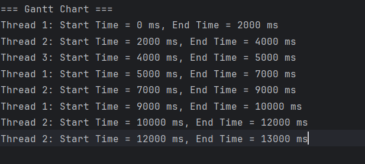

# Real-Time Multi-threaded Application Simulator

## Project Overview
The **Real-Time Multi-threaded Application Simulator** is designed to demonstrate various multithreading models and thread synchronization techniques. This simulator provides a **graphical representation** of how threads interact, execute, and synchronize using **semaphores and monitors**. It also includes **CPU scheduling techniques**, allowing users to understand how operating systems manage multithreading.

## Features
- **Multithreading Models:** Supports **Many-to-One, One-to-One, and Many-to-Many** threading models.
- **Thread Synchronization:** Implements **semaphores** and **monitors** for shared resource management.
- **Gantt Chart Visualization:** Displays real-time **thread execution timelines**.
- **CPU Scheduling Algorithms:** Simulates **Round-Robin, FCFS, and SJN scheduling techniques**.
- **Execution Logging & Reports:** Saves execution logs and **Gantt Chart reports in TXT format**.

## Screenshots

### Simulator UI


### Gantt Chart


## Installation & Setup

### Prerequisites:
- **Java JDK 17 or later**
- **IntelliJ IDEA / Eclipse** (or any preferred IDE)
- **Git** for version control

### Steps:
1. Clone the repository:
   ```sh
   git clone https://github.com/utsav1223/RealTime-Multithreaded-Application--Simulator.git
   ```
2. Open the project in your preferred **IDE**.
3. Ensure the required dependencies are installed.
4. Compile and run the Java program:
   ```sh
   javac MultiThreadingSimulatorGUI.java
   java MultiThreadingSimulatorGUI
   ```

## Usage

### 1. Select Threading Model
- **Many-to-One:** Multiple threads mapped to a single OS thread.
- **One-to-One:** Each thread has its own OS-level thread.
- **Many-to-Many:** Multiple user threads mapped to multiple OS threads.

### 2. Input Execution Parameters
- Enter the **number of threads (1-6)**.
- Choose the **threading model**.
- Set **execution time or scheduling policy** (e.g., time quantum for Round-Robin).

### 3. View Execution Logs & Gantt Chart
- Real-time **logs** will be displayed in the GUI.
- The **Gantt Chart visualization** helps understand **thread execution order**.
- Logs and charts are **saved automatically** in TXT format.

## Technologies Used
- **Programming Language:** Java
- **GUI Development:** Swing/AWT
- **Thread Management:** Java Threads
- **Synchronization:** Semaphores & Monitors
- **Logging:** BufferedWriter & FileWriter
- **Version Control:** GitHub

## Future Enhancements
- **Additional Scheduling Algorithms:** Implementing **SRTF & Priority Scheduling**.
- **Performance Metrics:** Execution time comparisons & efficiency analysis.
- **Cloud Integration:** Running simulations in **cloud-based environments**.
- **Enhanced Visualization:** Improving real-time monitoring & interactive UI.

## Contributors
- [Your Name] - Developer

## License
This project is licensed under the **MIT License** - see the [LICENSE](LICENSE) file for details.

## Repository Link
[Real-Time Multi-threaded Application Simulator](https://github.com/utsav1223/RealTime-Multithreaded-Application--Simulator)

